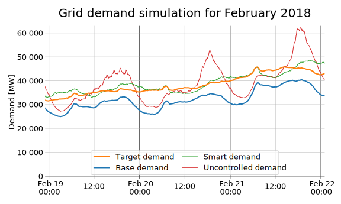

<h1 align="center">Demand Management in Smart Grids</h1>
 

A diploma thesis investigating the options of controlling power demand of households to reduce peaks in total power consumption in smart grids.

The problem
-----------
While the widespread adoption of electric vehicles in the future could serve to reduce our reliance on fossil fuels, provided that the energy used to charge those vehicles comes from cleaner sources, the increased electricity usage that would come as a side effect could constitute a challenge to the electrical grid. Most trips by household-owned vehicles are trips to work and back, and most people plug in their car to charge it as soon as they arrive home. As the bulk of the people arrive home around the same time, this can cause peaks in electricity consumption in the afternoon hours.

Because traditional coal or nuclear power plants have a long ramp-up time, they are ill-suited to be used to cover these sudden peaks, and specialized peaking power plants such as gas turbines or pumped hydroelectric energy storage must be used, which is costly and not always feasible. The situation is further complicated as power plants utilizing renewable energy sources are being introduced to the grid. These plants, such as solar panel farms or wind turbines, often have an uncontrollable and intermittent power output, requiring even more energy storage to compensate.

To combat these negative effects, there arises a need to be able to better control the electricity demand of the grid by matching the power requirements of electricity subscribers to the generation profile of the power plants.

There are several proposed strategies to achieve that goal, but they have several key issues, one of them being their privacy implications, as most of them require the EV owners to inform the distributor or another third party about their travel schedule and charging needs, which some might not be willing to do. Another weak point is that the strategies control only electric cars, and do not take into account other appliances that could be controlled. Furthemore, most of the strategies require that subscribers are willing to adhere to them, even though it might not be directly beneficial to them.

Our proposed solution
---------------------
To tackle the issues with the current strategies, we decided to employ the strategy of motivating the subscribers to use energy at specific times by means of time-of-use electricity price tariffs, with different timing of low and high prices for each connected household.

The electricity distributor decides on a total target electricity demand profile which it would like to achieve on its grid according to its needs (e.g. a flat demand profile for a grid consisting of power plants with slow demand-response characteristics, or a profile with higher demand during specific intervals for a grid containing solar plants or wind turbines when expecting a lot of sunlight or wind).

A part of this demand does not come from subscribers whose demand can be influenced easily, but instead from other sectors like businesses and industrial customers. The part of the demand the distributor can influence, like the demand of households, can be used for balancing the demand of the rest of the grid to achieve the desired total demand. The distributor must therefore separate the total target demand profile into the uninfluenceable base demand and the influenceable target household demand.

The electricity prices for each household are then assigned so that more households get a high price when their demand should be low, and a low price when their demand should be high. The electricity prices are finally distributed to the households, and the decision on when to turn their appliances on is left to them, expecting them to act in their own interest and optimize their appliance usage to achieve the lowest total cost of electricity.

This achieves the goals described earlier — privacy of the subscribers is protected, since they do not need to divulge the information about the usage of their appliances; multiple types of appliances can be controlled, since they only need to be able to adjust their operation to the electricity price; and the subscribers are incentivized to use energy in coordination with the needs of the distributor, as it will also be cheaper for them.

A more detailed description of our solution can be found in the [thesis text](thesis/thesis.pdf).

[Simulator](simulator/)
-----------------------
For evaluating the effectiveness of the demand control algorithm, we created a simulator of the smart grid. The simulator currently simulates the Texas power grid, based on data from the [Electricity Reliability Council of Texas](http://www.ercot.com), the [Pecan Street organization](https://www.pecanstreet.org/) and the [National Household Travel Survey](https://nhts.ornl.gov/), which it can directly download and parse.

Its structure was designed to resemble a real electrical distribution grid, with each part of the grid being a separate entity, operating independently, keeping its own clock and performing calculations exactly when needed, according to an environment-provided clock signal. This was done to allow for easier possible future extension of the simulator or its separation into multiple programs communicating over some network interface to enable simulating communication delays and other physical limitations of the distribution grid.

The simulator implements our algorithm described in the thesis, and two simpler demand control algorithms used for comparison with the first one — an algorithm where appliances stretch their power demand across their whole usage interval, and an algorithm where they perform their operation as early as possible.

The simulator is written in Python, and it's purpose-built for this thesis, so extending it for different uses would be quite comples, but the legwork is there. There are certainly some improvements that could be made, most prominently the use of multithreading, but that shouldn't be too complicated now with the multiprocessing improvements in Python 3.8.

To try the simulator, download the [latest release](https://www.github.com/fnesveda/DemandManagement/releases/latest/) and unpack it. Usage instructions can be found in the included [README file](simulator/README.md).
